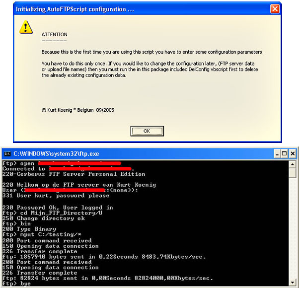



## AutoFTP

### Description

This script runs ftp.exe, which is already present in your system32 folder, in the Windows shell and uploads one or more files to an FTP server depending on the configuration parameters you provide the first time you run the script. The settings for the FTP server are stored in a file in the system32 folder. There's also another script to delete this configuration file. When you delete the configuration file new parameters will be asked the next time you run the AutoFTP.vbs script.

UPDATED: I have added some error checking. Some comments are also included now...
 
### More Info
 
You need to input the same parameters as are used by all FTP client programs when running this script for the first time.

             |
---                |---
**Submitted On**   |2005-09-21 10:26:18
**By**             |[Kurt Koenig](https://github.com/Planet-Source-Code/PSCIndex/blob/master/ByAuthor/kurt-koenig.md)
**Level**          |Intermediate
**User Rating**    |4.7 (14 globes from 3 users)
**Compatibility**  |VB Script
**Category**       |[Miscellaneous](https://github.com/Planet-Source-Code/PSCIndex/blob/master/ByCategory/miscellaneous__1-1.md)
**World**          |[Visual Basic](https://github.com/Planet-Source-Code/PSCIndex/blob/master/ByWorld/visual-basic.md)
**Archive File**   |[AutoFTP1934339212005\.zip](https://github.com/Planet-Source-Code/kurt-koenig-autoftp__1-62615/archive/master.zip)

